# Crayon Crew Illustrations

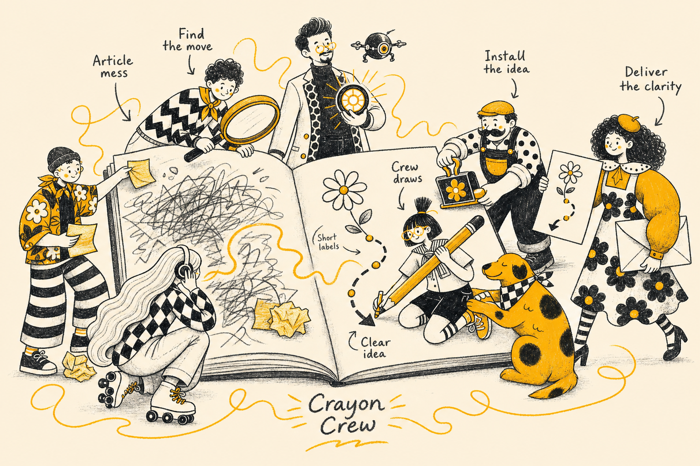

> Turn the key ideas, processes, and metaphors in your articles into warm, hand-drawn crayon illustrations — with a consistent recurring character cast, on any AI agent.
>
> Landscape 4:3 | Cream paper + charcoal + marigold | Recurring cast of 8 | Short handwritten English labels | Agent-agnostic skill

---

## What this is

Crayon Crew Illustrations is an [Agent Skill](https://agentskills.io) that teaches an AI agent how to plan and generate in-article illustrations for blog posts, docs, newsletters, and methodology content.

It is not a generic illustration prompt and not an infographic template. The workflow is: first understand the article's cognitive anchors, then turn one judgment, process, structure, state, or metaphor at a time into a single memorable hand-drawn image that a reader understands in seconds — with short handwritten labels explaining the process.

The visual world is fixed and always consistent:

- Warm cream paper background, grainy charcoal crayon linework
- One accent color: marigold yellow
- Bold black-and-white patterns (stripes, checkers, daisies)
- Loose yellow scribble energy lines and oversized props
- A recurring cast of eight characters (the Crayon Crew) who always perform the core action, never just decorate

In one sentence: **the agent doesn't "add an image" — it draws the key cognitive move of your article.**

## Works with any agent

The skill follows the open `SKILL.md` format (YAML frontmatter + markdown instructions), which is supported by every major coding agent. Nothing in it is tool-specific: it instructs the agent to use *whatever image generation capability it has* (built-in image tool, image MCP server, or API) and to attach the bundled style reference images whenever the tool supports reference inputs.

| Agent | Personal (global) install | Docs |
|---|---|---|
| Cursor | `~/.cursor/skills/` | [cursor.com/docs/skills](https://cursor.com/docs/skills) |
| Claude Code | `~/.claude/skills/` | [code.claude.com/docs/en/skills](https://code.claude.com/docs/en/skills) |
| Codex | `~/.agents/skills/` | [developers.openai.com/codex/skills](https://developers.openai.com/codex/skills) |
| Kiro | `~/.kiro/skills/` | [kiro.dev/docs/skills](https://kiro.dev/docs/skills/) |

Project-scoped alternatives (commit with the repo): Cursor `.cursor/skills/`, Claude `.claude/skills/`, Codex `.agents/skills/`, Kiro `.kiro/skills/`.

### Install

```bash
git clone https://github.com/<your-username>/crayon-crew-illustrations.git
cd crayon-crew-illustrations
```

Then run the installer. Cursor is the default:

```bash
./install.sh            # Cursor → ~/.cursor/skills/
./install.sh --cursor   # same as above
./install.sh --claude   # Claude Code → ~/.claude/skills/
./install.sh --codex    # Codex → ~/.agents/skills/
./install.sh --kiro     # Kiro → ~/.kiro/skills/
```

Re-running the script replaces any existing install of this skill for that agent.

> Note: the agent needs an image generation capability (a built-in image tool, or an image-generation MCP server / API). The skill adapts to whichever one is available.

## How to use it

### Plan only (shot list, no generation)

```text
Use the crayon-crew-illustrations skill. Don't generate yet.
Analyze this article and tell me where illustrations belong.
Output a shot list: placement, theme, core idea, structure type,
which crew member does what, and suggested labels.

<paste article>
```

### Generate illustrations for an article

```text
Use the crayon-crew-illustrations skill.
Generate 4 illustrations for the article below.

<paste article>
```

### One image for one concept

```text
Use the crayon-crew-illustrations skill.
Generate one illustration for the idea "consistency beats intensity —
small daily publishing compounds into an audience."
```

### Edit an existing image

```text
Use the crayon-crew-illustrations skill.
Edit this image: remove the "Workflow" text in the corner, keep everything else.
```

## The cast

Eight recurring characters, fully specified in `crayon-crew-illustrations/references/character-cast.md`:

| Character | Role | Cast them for |
|---|---|---|
| **Penny** | The maker — messy bun with a pencil in it, round glasses, marigold pinafore, giant pencil | Creating, building, executing |
| **Fern** | The thinker — fluffy curls, squiggle sweater, giant tea mug, thought scribbles | Thinking, reading, being stuck, reacting |
| **Margo** | The messenger — tall and elegant, side-ponytail with ribbon, daisy skirt, giant envelope | Publishing, delivering, handoffs |
| **Echo** | The listener — petite, floor-length pale braids, headphones, checkerboard top | Gathering input, filtering, feedback |
| **Otto** | The builder — mustache, flat cap, polka-dot shirt, overalls, giant wrench | Fixing, assembling, infrastructure, maintenance |
| **Spark** | The tech guy — goatee, marigold glasses, honeycomb jacket, glowing arc disc + drone | Inventing / demos / prototypes only — not every tech shot |
| **Milo** | The explorer — curly hair, neckerchief, zigzag sweater, giant magnifying glass | Searching, investigating, discovery, roadmaps |
| **Doodle** | The dog — scruffy white coat, marigold patches, scroll in mouth | Fetching, automation, comic relief |

Their appearance never changes; their poses, props, and jobs change with every article. The eight images in `crayon-crew-illustrations/assets/style-references/` are the canonical look — the skill attaches them as style references on every generation, which is what keeps the output consistent. All eight are original references generated for this skill.

## Example output

Real outputs generated with this skill. They are style and workflow samples — invent a fresh metaphor for each new article; don't copy these compositions.

### Optimizing AI tokens

Prompt: *“create a blog about optimizing AI usage token to improve productivity and creativity”*

#### Waste vs focused ask

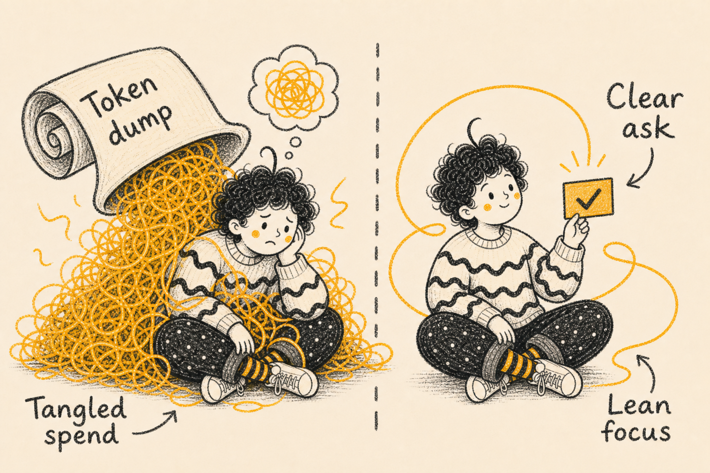

#### Token budget jar

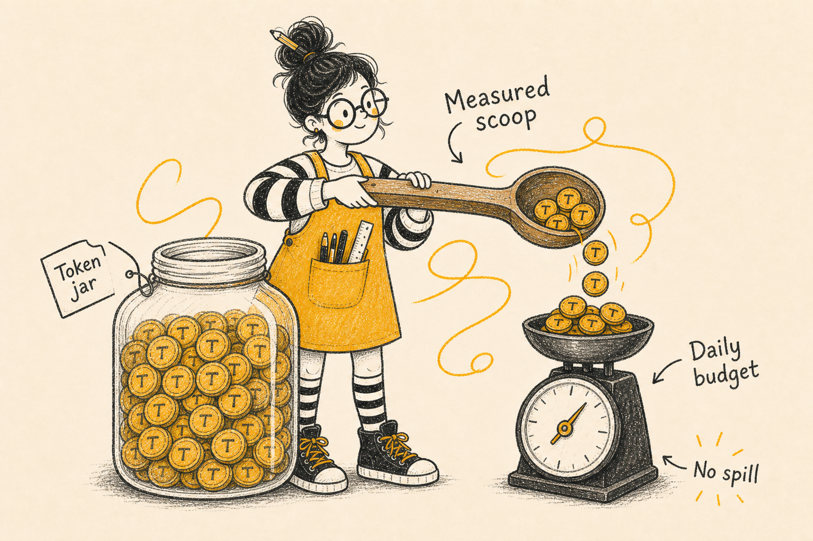

#### Filter context

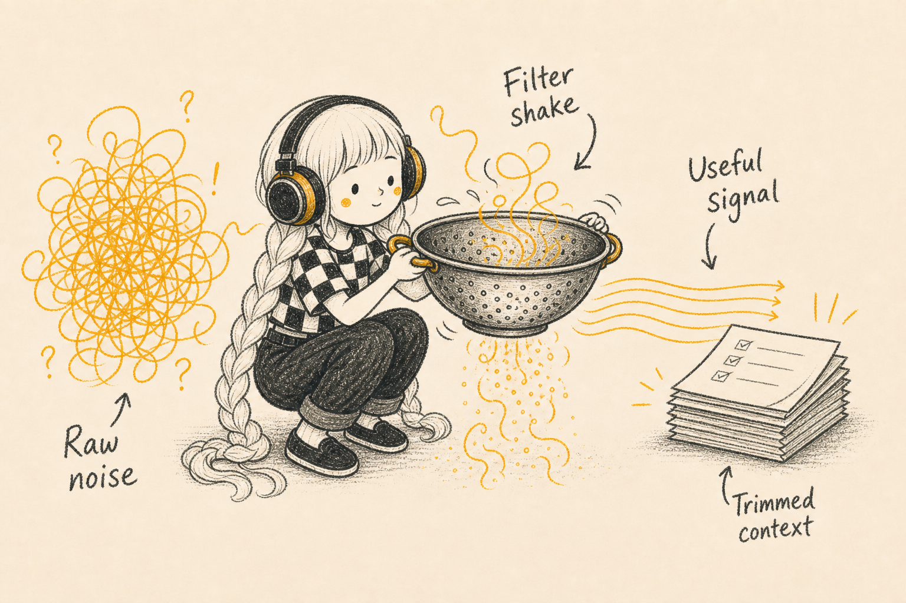

#### Reusable prompt stamps

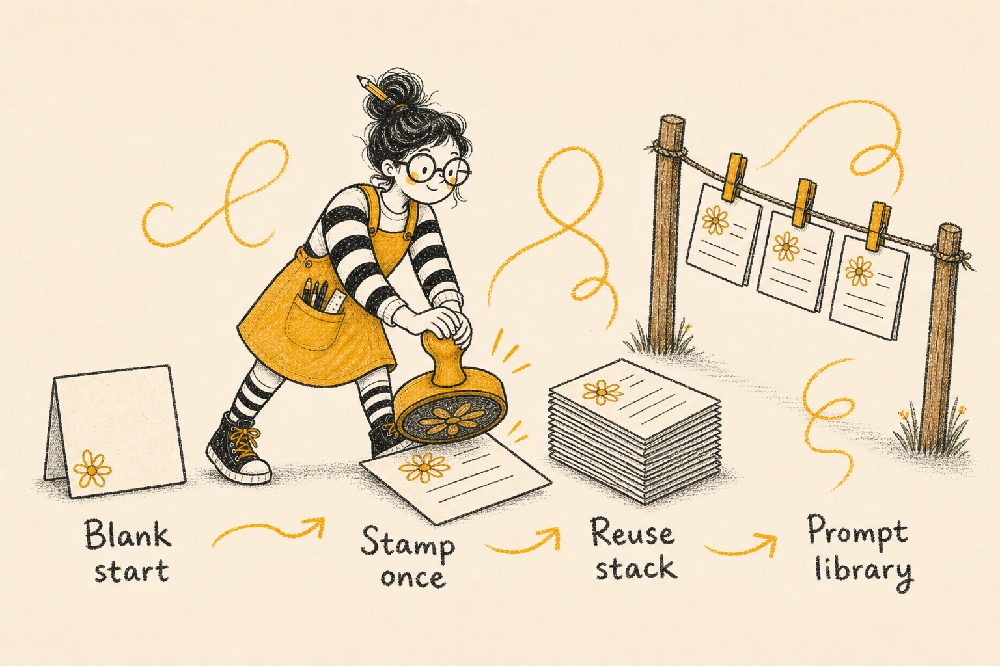

#### Lean creative harvest

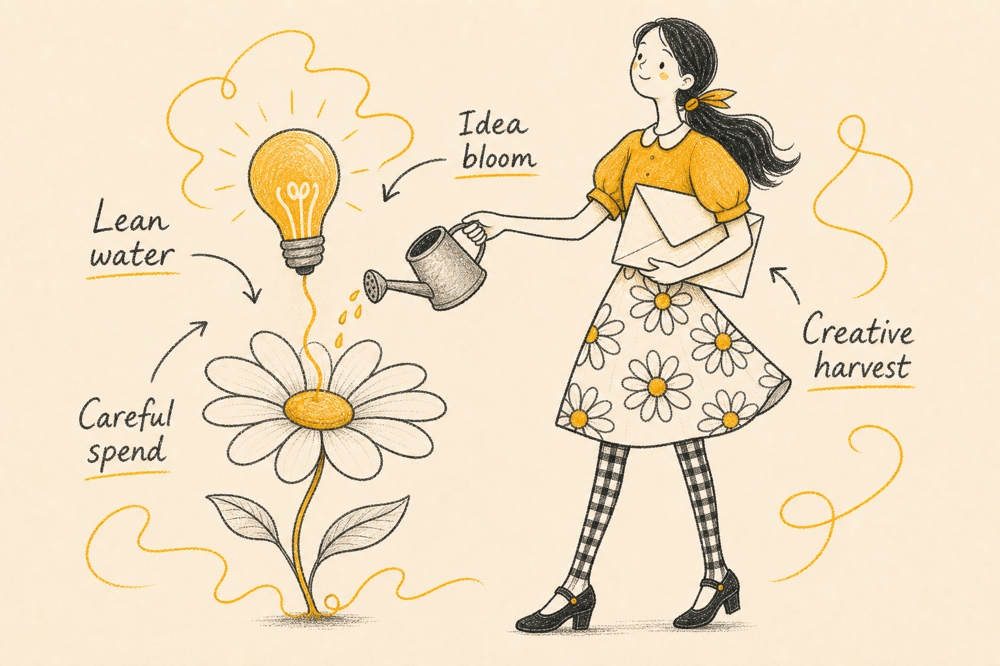

### MCP makes AI a superhero

Prompt: *“mcp is the way you let your ai become superhero”*

#### Chat-only vs MCP powers

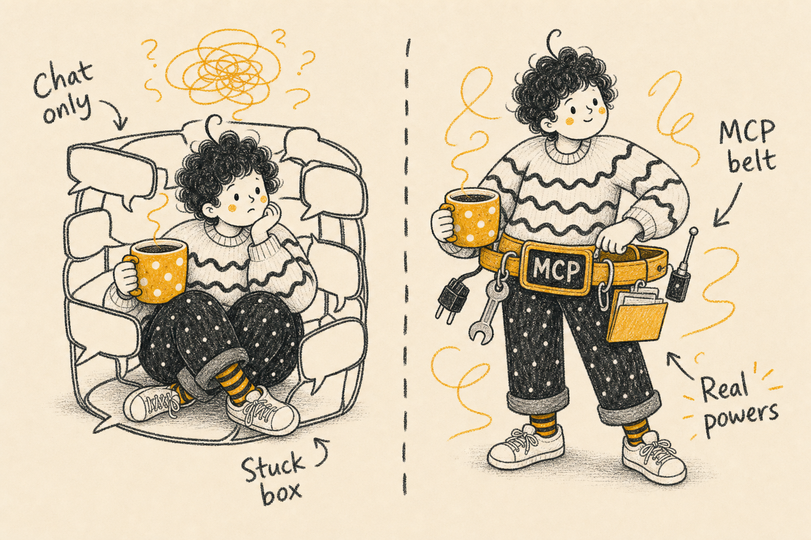

#### MCP utility belt

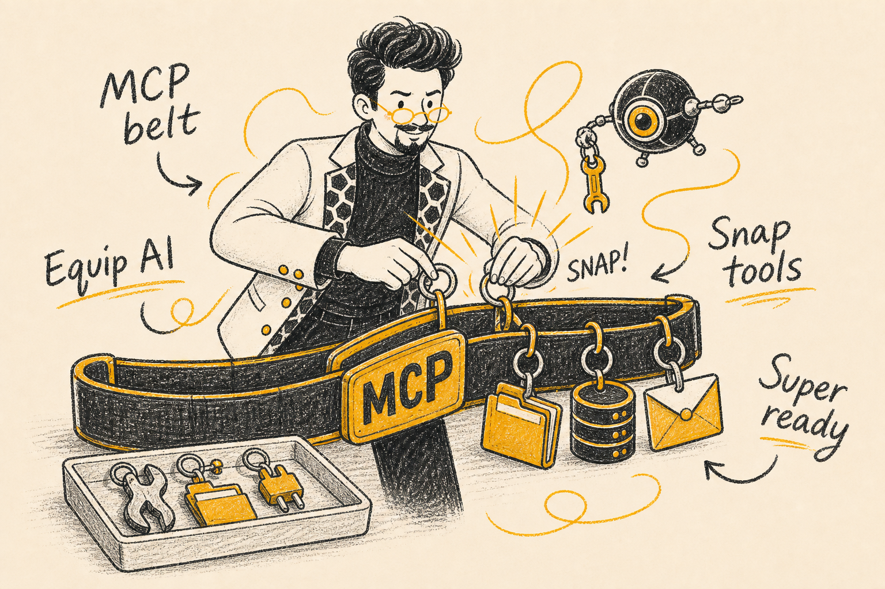

#### Plug into tools

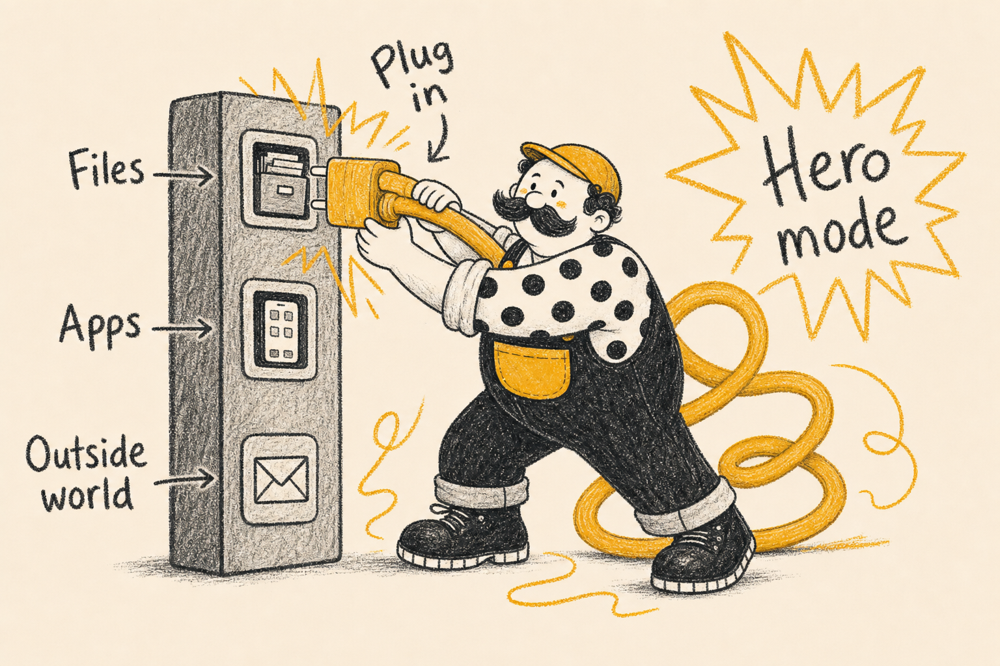

### Teach AI with skills

Prompt: *“stop tell your ai what to do, teach them with skills instead”*

#### Orders vs skills

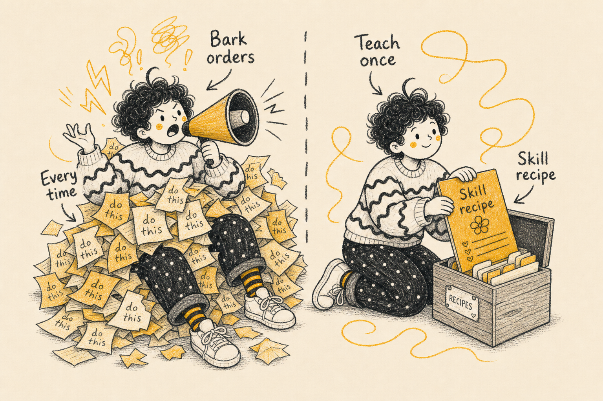

#### Fold the skill

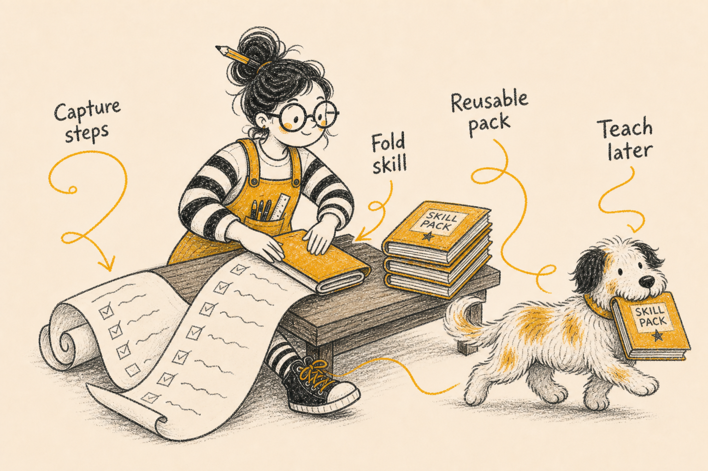

#### Load skill box

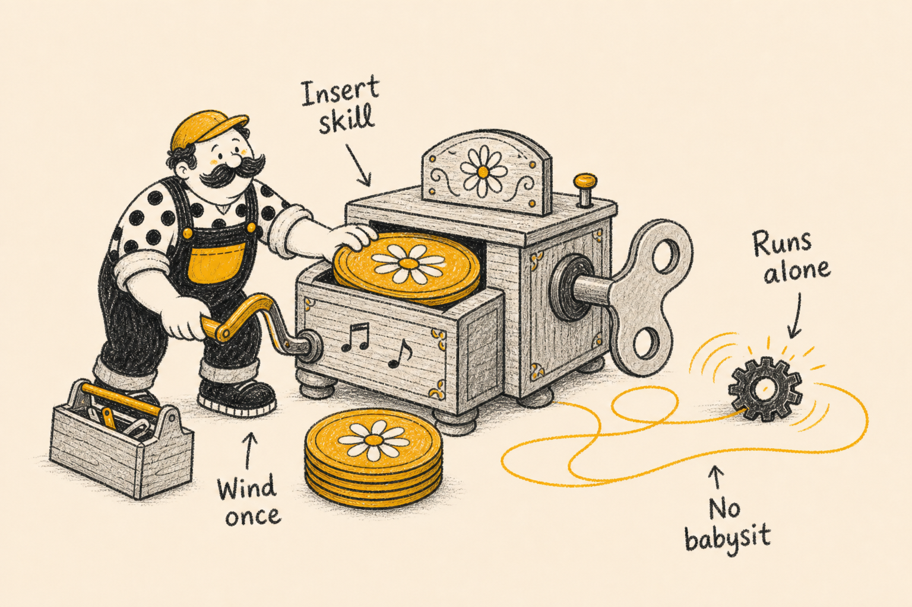

## Make it yours

Transparency and tweakability are the point of this skill. Every stylistic decision lives in exactly one plain-markdown file, and `references/customization.md` documents how to safely change:

- The accent color (swap marigold for coral, sage, anything)
- The label language (English by default; any language works)
- The aspect ratio, label density, and metaphor world
- The cast: rename, re-personalize, or add characters

It also documents which changes are risky (removing style reference images, adding a second accent color) and why.

## Structure

```text
.
├── README.md
├── LICENSE
├── NOTICE.md
├── install.sh                        ← installs for Cursor / Claude / Codex / Kiro
├── output-examples/                  ← sample generated illustrations (shown above)
│   ├── optimizing-ai-tokens-illustrations/
│   ├── mcp-ai-superhero-illustrations/
│   └── teach-ai-with-skills-illustrations/
└── crayon-crew-illustrations/        ← the installable skill
    ├── SKILL.md                      ← workflow the agent follows
    ├── agents/
    │   └── openai.yaml               ← Codex UI metadata (optional)
    ├── assets/
    │   └── style-references/         ← 8 original character reference images
    └── references/
        ├── style-dna.md              ← palette, texture, hard bans
        ├── character-cast.md         ← the eight crew members, fully specified
        ├── composition-patterns.md   ← structure types + original-metaphor method
        ├── prompt-template.md        ← fill-in generation & editing prompts
        ├── qa-checklist.md           ← post-generation checks + iteration playbook
        └── customization.md          ← how to fork and tweak safely
```

## Good to know

- Shorter labels render more reliably; the skill enforces 1–4 words per label.
- One image = one idea. The skill refuses to cram an article into a single infographic.
- If a character could be removed from an image without losing meaning, the skill regenerates — characters must do the work, not decorate.
- Image models drift: the bundled QA checklist catches off-palette colors, off-model characters, and garbled text, and prescribes fixes.

## Acknowledgements

This skill stands on two inspirations:

- **[ian-xiaohei-illustrations](https://github.com/helloianneo/ian-xiaohei-illustrations)** by [Ian (helloianneo)](https://github.com/helloianneo) — the planning workflow (digest → shot list → generate one-by-one → QA → deliver), the idea of a recurring character IP that performs the core action, and the skill packaging pattern. This project reimagines that approach in English, with a different visual identity, agent-agnostic install paths, and a documented customization layer.
- **[tubik.arts](https://dribbble.com/tubik_arts)** — aesthetic inspiration only: warm cream paper, grainy crayon texture, charcoal + marigold restraint, bold patterns, and oversized-prop playfulness. No Tubik artwork is used or redistributed in this repository. The Crayon Crew cast and all style-reference images are original designs generated for this skill.

See [NOTICE.md](NOTICE.md) for attribution details.

## License

MIT
